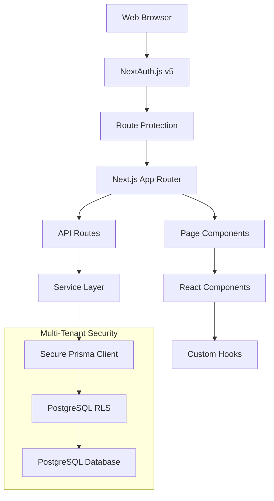

# 🏛️ Kreancia System Architecture

## Overview

Kreancia is designed as a modern, multi-tenant SaaS application with strict data isolation and security. The architecture follows Next.js 15 App Router patterns with a service-oriented approach for business logic.

## 🏗️ High-Level Architecture



## 🎯 Key Architectural Decisions

### 1. Multi-Tenant Strategy: Row Level Security (RLS)

**Decision**: Use PostgreSQL Row Level Security instead of database-per-tenant or schema-per-tenant.

**Rationale**:
- ✅ **Single Database**: Simplified maintenance and backups
- ✅ **Automatic Enforcement**: Cannot be bypassed at application level
- ✅ **Performance**: Single connection pool, optimized queries
- ✅ **Cost Effective**: Shared infrastructure

**Implementation**:
```typescript
// Secure Prisma Client automatically injects merchant context
const secureClient = getSecurePrismaClient()
const client = await secureClient.withSession({
  merchantId: session.user.merchantId,
  userId: session.user.id
})
```

### 2. Authentication Strategy: NextAuth.js v5

**Decision**: Use NextAuth.js v5 with credentials provider and JWT strategy.

**Rationale**:
- ✅ **Security**: Battle-tested authentication library
- ✅ **Flexibility**: Custom credential validation against Merchant table
- ✅ **Session Management**: JWT with encrypted merchant context
- ✅ **Future-Proof**: Easy to add OAuth providers later

### 3. Data Access Pattern: Service Layer

**Decision**: Centralize business logic in service classes rather than direct Prisma calls in components.

**Benefits**:
- ✅ **Consistency**: Uniform business rules across all endpoints
- ✅ **Testing**: Easier to unit test business logic
- ✅ **Reusability**: Services used by both API routes and Server Components
- ✅ **Type Safety**: Strong TypeScript contracts

## 🔧 Core Components

### 1. Authentication Layer

```typescript
// Authentication flow
Browser → NextAuth.js → Credentials Provider → bcrypt validation → JWT Session
```

**Key Files**:
- `src/lib/auth.ts` - NextAuth.js configuration
- `src/middleware.ts` - Route protection
- `src/app/api/auth/[...nextauth]/route.ts` - Auth endpoints

### 2. Multi-Tenant Security Layer

```typescript
// RLS enforcement flow
API Request → Session validation → SecurePrismaClient → RLS injection → Query execution
```

**Key Files**:
- `src/lib/prisma-rls.ts` - Secure Prisma wrapper
- `src/middleware/tenant.ts` - Tenant context middleware
- Database policies in migrations

### 3. Service Layer

```typescript
// Service pattern
Controller/Component → Service → SecurePrismaClient → Database
```

**Services**:
- `ClientService` - Client management operations
- `CreditService` - Credit tracking and calculations  
- `PaymentService` - Payment processing and FIFO allocation

### 4. Frontend Architecture

```typescript
// Frontend data flow
Page Component → Custom Hook → API Route → Service → Database
```

**Patterns**:
- Server Components for initial data loading
- Client Components for interactive features
- Custom hooks for API integration
- Optimistic updates where appropriate

## 📊 Data Flow Patterns

### 1. Read Operations
```
Page Load → Server Component → Direct service call → SecurePrismaClient → Database
```

### 2. Write Operations
```
User Action → Client Component → API Route → Service Layer → SecurePrismaClient → Database
```

### 3. Real-time Updates
```
Form Submit → Optimistic Update → API Call → Server Validation → Database Update → UI Sync
```

## 🔒 Security Architecture

### 1. Authentication Security
- **Password Hashing**: bcrypt with 10 salt rounds
- **Session Management**: Encrypted JWT tokens
- **CSRF Protection**: NextAuth.js built-in protection
- **Session Expiry**: Configurable session lifetimes

### 2. Multi-Tenant Security
- **RLS Policies**: Database-level isolation
- **Session Context**: Automatic merchant ID injection
- **Query Filtering**: All queries automatically filtered by merchant
- **Admin Separation**: CLI tools for merchant management

### 3. API Security
- **Input Validation**: Zod schemas on all endpoints
- **Type Safety**: End-to-end TypeScript
- **Error Handling**: Sanitized error responses
- **Rate Limiting**: (Planned) Request rate limiting

## 🚀 Performance Considerations

### 1. Database Performance
- **Connection Pooling**: Prisma connection pooling
- **Query Optimization**: Generated Prisma queries
- **Indexing Strategy**: Merchant-aware indexes
- **RLS Optimization**: Efficient policy definitions

### 2. Frontend Performance
- **Server Components**: Reduce client JavaScript
- **Code Splitting**: Automatic Next.js splitting
- **Image Optimization**: Next.js Image component
- **Bundle Analysis**: Webpack bundle analyzer

### 3. Caching Strategy
- **Static Generation**: ISR for dashboard data
- **API Response Caching**: (Planned) Redis cache layer
- **Client Caching**: React Query integration (planned)

## 📈 Scalability Design

### 1. Horizontal Scaling
- **Stateless Design**: JWT sessions enable horizontal scaling
- **Database Separation**: Easy to separate read replicas
- **Microservice Ready**: Service layer enables future microservice migration

### 2. Multi-Region Support
- **Database Replication**: PostgreSQL streaming replication
- **CDN Integration**: Static asset distribution
- **Edge Deployment**: Vercel Edge Functions ready

## 🛠️ Development Architecture

### 1. Development Tools
- **TypeScript**: End-to-end type safety
- **Prisma**: Type-safe database access
- **ESLint/Prettier**: Code quality and formatting
- **Zod**: Runtime schema validation

### 2. Testing Strategy
- **Unit Tests**: Service layer testing
- **Integration Tests**: API endpoint testing
- **E2E Tests**: Critical user journey testing
- **Type Testing**: TypeScript compilation tests

### 3. Deployment Pipeline
- **Build Process**: Next.js optimized builds
- **Database Migrations**: Automated Prisma migrations
- **Environment Management**: Environment-specific configurations
- **Health Checks**: Application health monitoring

## 🔄 Future Architecture Considerations

### 1. Planned Enhancements
- **Event-Driven Architecture**: Domain events for complex workflows
- **Caching Layer**: Redis for session and data caching
- **Background Jobs**: Queue system for async operations
- **Monitoring**: Application performance monitoring

### 2. Migration Paths
- **Microservices**: Service layer enables easy microservice extraction
- **Event Sourcing**: Credit/payment history as events
- **CQRS**: Separate read/write models for complex reporting

---

> **Next**: [Multi-Tenant Security Implementation](./multi-tenant-rls.md)
> 
> **Related**: [Database Schema](./database-schema.md) | [API Patterns](../api/api-patterns.md)