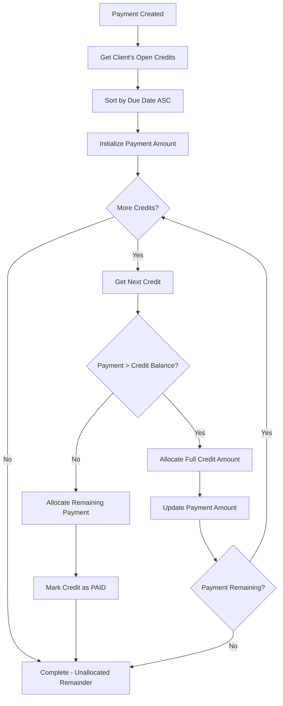
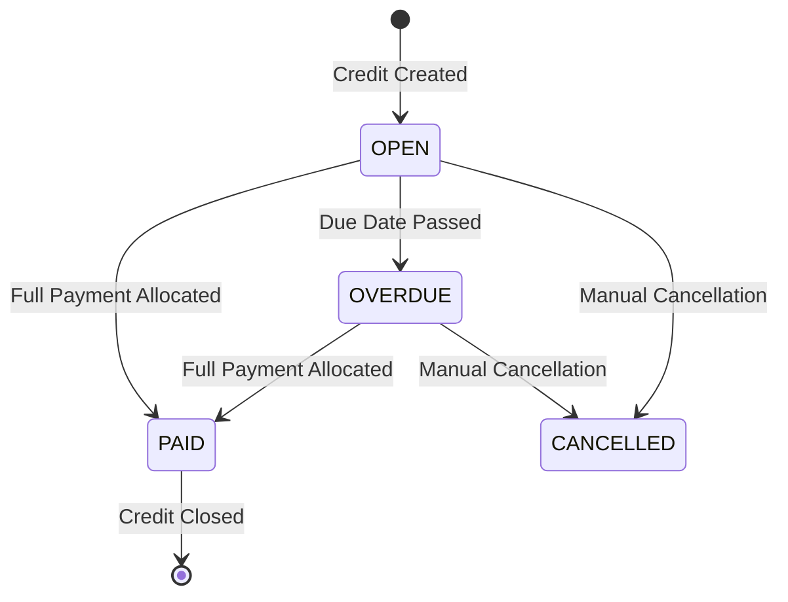

# 💳 Payment Allocation System

## Overview

Kreancia implements a sophisticated payment allocation system using the FIFO (First In, First Out) methodology to automatically distribute payments across outstanding credits. This ensures fair and predictable payment application.

## 🎯 Core Principles

### 1. FIFO (First In, First Out)
- Payments are applied to the **oldest** credits first
- Credits are ordered by due date (earliest due date first)
- Ensures fair treatment of all outstanding debts

### 2. Automatic Allocation
- Payments are automatically allocated upon creation
- No manual intervention required for standard FIFO allocation
- Manual allocation available for special cases

### 3. Partial Allocations
- Payments can be partially allocated across multiple credits
- Credits can receive partial payments from multiple sources
- Remaining balances are tracked accurately

## 🔄 FIFO Algorithm Implementation

### Algorithm Flow


### Code Implementation
```typescript
// src/lib/payment-service.ts
export class PaymentService {
  async allocatePaymentFIFO(paymentId: string, amount: number, clientId: string) {
    // 1. Get all open credits for the client, ordered by due date
    const openCredits = await this.prisma.credit.findMany({
      where: {
        clientId,
        status: 'OPEN',
        merchantId: this.merchantId
      },
      orderBy: {
        dueDate: 'asc'  // FIFO: oldest first
      }
    })

    let remainingPayment = amount
    const allocations: PaymentAllocation[] = []

    // 2. Allocate payment across credits
    for (const credit of openCredits) {
      if (remainingPayment <= 0.01) break // Avoid floating point precision issues

      const creditBalance = Number(credit.remainingAmount)
      const allocationAmount = Math.min(remainingPayment, creditBalance)

      // 3. Create allocation record
      const allocation = await this.prisma.paymentAllocation.create({
        data: {
          paymentId,
          creditId: credit.id,
          amount: allocationAmount
        }
      })

      // 4. Update credit balance
      const newRemainingAmount = creditBalance - allocationAmount
      await this.prisma.credit.update({
        where: { id: credit.id },
        data: {
          remainingAmount: newRemainingAmount,
          status: newRemainingAmount <= 0.01 ? 'PAID' : 'OPEN'
        }
      })

      allocations.push(allocation)
      remainingPayment -= allocationAmount
    }

    return {
      allocations,
      totalAllocated: amount - remainingPayment,
      unallocatedAmount: remainingPayment
    }
  }
}
```

## 💰 Allocation Scenarios

### Scenario 1: Full Payment Allocation
```
Payment: $100
Open Credits:
- Credit A: $30 (due 2024-01-01)
- Credit B: $40 (due 2024-02-01)  
- Credit C: $50 (due 2024-03-01)

Result:
- Credit A: $0 remaining (PAID) ← $30 allocated
- Credit B: $0 remaining (PAID) ← $40 allocated  
- Credit C: $20 remaining (OPEN) ← $30 allocated
- Payment: $100 allocated, $0 unallocated
```

### Scenario 2: Partial Payment
```
Payment: $50
Open Credits:
- Credit A: $30 (due 2024-01-01)
- Credit B: $40 (due 2024-02-01)

Result:
- Credit A: $0 remaining (PAID) ← $30 allocated
- Credit B: $20 remaining (OPEN) ← $20 allocated
- Payment: $50 allocated, $0 unallocated
```

### Scenario 3: Excess Payment
```
Payment: $200
Open Credits:
- Credit A: $30 (due 2024-01-01)
- Credit B: $40 (due 2024-02-01)

Result:
- Credit A: $0 remaining (PAID) ← $30 allocated
- Credit B: $0 remaining (PAID) ← $40 allocated
- Payment: $70 allocated, $130 unallocated
```

## 🎛️ Manual Allocation

For special cases, manual allocation allows precise control over payment distribution.

### Manual Allocation Request
```typescript
interface ManualAllocationRequest {
  paymentId: string
  allocations: Array<{
    creditId: string
    amount: number
  }>
}
```

### Validation Rules
1. **Total Allocation ≤ Payment Amount**: Cannot allocate more than payment total
2. **Credit Ownership**: Credits must belong to the payment's client
3. **Credit Status**: Can only allocate to OPEN credits
4. **Positive Amounts**: All allocation amounts must be positive
5. **Available Balance**: Cannot allocate more than credit's remaining balance

### Manual Allocation Example
```typescript
// Manual allocation request
const manualAllocation = {
  paymentId: 'payment-123',
  allocations: [
    { creditId: 'credit-456', amount: 25.00 },
    { creditId: 'credit-789', amount: 75.00 }
  ]
}

// API call
POST /api/payments/allocate
{
  "paymentId": "payment-123",
  "allocations": [
    { "creditId": "credit-456", "amount": 25 },
    { "creditId": "credit-789", "amount": 75 }
  ]
}
```

## 📊 Allocation Tracking

### PaymentAllocation Entity
```typescript
interface PaymentAllocation {
  id: string
  paymentId: string        // Reference to payment
  creditId: string         // Reference to credit  
  amount: number          // Allocated amount
  createdAt: Date         // Allocation timestamp
}
```

### Allocation History
Every allocation creates an immutable record:
- **Audit Trail**: Complete history of all payment applications
- **Reversibility**: Allocations can be reversed if needed
- **Reporting**: Detailed payment allocation reports
- **Reconciliation**: Easy matching of payments to credits

## 🔍 Credit Status Management

### Status Transitions


### Status Rules
- **OPEN**: Credit has remaining balance, not past due
- **OVERDUE**: Credit has remaining balance, past due date
- **PAID**: Credit fully paid (remaining balance ≤ $0.01)
- **CANCELLED**: Credit manually cancelled

### Automatic Status Updates
```typescript
// After each allocation, update credit status
const updateCreditStatus = (credit: Credit) => {
  const remaining = Number(credit.remainingAmount)
  const now = new Date()
  
  if (remaining <= 0.01) {
    return 'PAID'
  } else if (credit.dueDate < now) {
    return 'OVERDUE'
  } else {
    return 'OPEN'
  }
}
```

## 💹 Allocation Reports

### Payment Allocation Summary
```typescript
interface AllocationSummary {
  payment: Payment
  totalAllocated: number
  unallocatedAmount: number
  creditsAffected: number
  allocations: Array<{
    credit: Credit
    amount: number
    creditBalanceBefore: number
    creditBalanceAfter: number
  }>
}
```

### Client Payment History
```sql
-- SQL query for client payment allocation history
SELECT 
  p.id as payment_id,
  p.amount as payment_amount,
  p.payment_date,
  p.method,
  c.id as credit_id,
  c.description,
  c.due_date,
  pa.amount as allocated_amount,
  pa.created_at as allocation_date
FROM payments p
JOIN payment_allocations pa ON p.id = pa.payment_id  
JOIN credits c ON pa.credit_id = c.id
WHERE p.client_id = $1
ORDER BY p.payment_date DESC, pa.created_at DESC
```

## 🔧 Advanced Features

### 1. Allocation Reversal
```typescript
// Reverse payment allocation (for corrections)
async reversePaymentAllocation(paymentId: string) {
  const allocations = await this.prisma.paymentAllocation.findMany({
    where: { paymentId },
    include: { credit: true }
  })

  // Restore credit balances
  for (const allocation of allocations) {
    await this.prisma.credit.update({
      where: { id: allocation.creditId },
      data: {
        remainingAmount: allocation.credit.remainingAmount + allocation.amount,
        status: 'OPEN' // Restore to OPEN status
      }
    })
  }

  // Delete allocation records
  await this.prisma.paymentAllocation.deleteMany({
    where: { paymentId }
  })
}
```

### 2. Batch Payment Processing
```typescript
// Process multiple payments in a single transaction
async processBatchPayments(payments: PaymentRequest[]) {
  return await this.prisma.$transaction(async (tx) => {
    const results = []
    
    for (const paymentRequest of payments) {
      const payment = await this.createPayment(paymentRequest)
      const allocation = await this.allocatePaymentFIFO(
        payment.id, 
        payment.amount, 
        payment.clientId
      )
      results.push({ payment, allocation })
    }
    
    return results
  })
}
```

### 3. Smart Allocation Rules (Planned)
- **Priority Credits**: Allocate to high-priority credits first
- **Interest Calculation**: Apply payments to interest before principal
- **Late Fees**: Handle late fee allocation logic
- **Currency Conversion**: Handle multi-currency payments

## 🧪 Testing Allocation Logic

### Unit Tests
```typescript
describe('FIFO Payment Allocation', () => {
  it('should allocate to oldest credit first', async () => {
    // Setup: Create credits with different due dates
    const olderCredit = await createCredit({ 
      amount: 100, 
      dueDate: new Date('2024-01-01') 
    })
    const newerCredit = await createCredit({ 
      amount: 100, 
      dueDate: new Date('2024-02-01') 
    })

    // Test: Create payment and allocate
    const payment = await paymentService.createPayment({
      amount: 150,
      clientId: client.id
    })

    // Verify: Older credit fully paid, newer credit partially paid
    const updatedOlderCredit = await getCredit(olderCredit.id)
    const updatedNewerCredit = await getCredit(newerCredit.id)
    
    expect(updatedOlderCredit.remainingAmount).toBe(0)
    expect(updatedOlderCredit.status).toBe('PAID')
    expect(updatedNewerCredit.remainingAmount).toBe(50)
    expect(updatedNewerCredit.status).toBe('OPEN')
  })
})
```

## 📈 Performance Considerations

### 1. Database Optimization
- **Indexes**: Composite indexes on (client_id, status, due_date)
- **Batch Operations**: Process multiple allocations in transactions  
- **Connection Pooling**: Efficient database connections

### 2. Large Payment Handling
- **Chunked Processing**: Handle payments with many credits in batches
- **Progress Tracking**: Show allocation progress for large operations
- **Timeout Handling**: Prevent timeout on complex allocations

### 3. Concurrent Payment Processing
- **Row Locking**: Prevent race conditions in credit updates
- **Transaction Isolation**: Ensure consistent allocation state
- **Retry Logic**: Handle temporary conflicts gracefully

---

> **Next**: [Credit System](./credit-system.md)
> 
> **Related**: [Payment API](../api/payments-api.md) | [Business Rules](./business-rules.md)