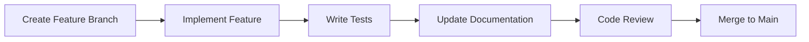

# 🚀 Development Workflow Guide

## Overview

This guide outlines the development workflow, best practices, and patterns used in the Kreancia project. Following these guidelines ensures consistent code quality and maintainable architecture.

## 🏁 Getting Started

### 1. Initial Setup
```bash
# Clone and setup
git clone <repository-url>
cd kreancia

# Environment setup
cp .env.local .env
# Edit .env with your database credentials

# Install dependencies
npm install

# Database setup
docker compose up -d              # Start PostgreSQL
npm run db:generate              # Generate Prisma client
npm run db:migrate              # Run migrations
npm run db:seed                 # Seed development data

# Start development server
npm run dev
```

### 2. Development Environment
- **Node.js**: Version 18+ (specified in package.json engines)
- **PostgreSQL**: Version 16+ (via Docker)
- **IDE**: VS Code with TypeScript, Prisma, and Tailwind extensions
- **Browser**: Chrome with React Developer Tools

## 🔄 Development Workflow

### 1. Feature Development Process



#### Step-by-Step Process
1. **Create Feature Branch**
   ```bash
   git checkout main
   git pull origin main
   git checkout -b feature/client-management-improvements
   ```

2. **Implement Feature**
   - Follow established patterns from existing code
   - Use TypeScript for type safety
   - Implement business logic in service layer
   - Create API routes following REST conventions

3. **Write Tests**
   ```bash
   # Run tests during development
   npm run test
   npm run type-check
   ```

4. **Update Documentation**
   - Update CLAUDE.md for new patterns
   - Add API documentation for new endpoints
   - Update component library docs for new components

5. **Code Review & Merge**
   ```bash
   git add .
   git commit -m "feat: improve client management with advanced filtering"
   git push origin feature/client-management-improvements
   # Create PR in GitHub
   ```

### 2. Branch Strategy

#### Branch Types
- **`main`**: Production-ready code
- **`feature/feature-name`**: New features
- **`fix/issue-description`**: Bug fixes
- **`docs/update-description`**: Documentation updates
- **`refactor/component-name`**: Code refactoring

#### Branch Naming
```bash
feature/client-profile-tabs        # New feature
fix/payment-allocation-bug         # Bug fix
docs/api-reference-update          # Documentation
refactor/auth-service-cleanup      # Refactoring
```

### 3. Commit Message Convention

Follow conventional commit format:
```
<type>(<scope>): <description>

[optional body]

[optional footer]
```

#### Types
- **feat**: New feature
- **fix**: Bug fix
- **docs**: Documentation changes
- **style**: Code style changes (formatting)
- **refactor**: Code refactoring
- **test**: Adding or updating tests
- **chore**: Maintenance tasks

#### Examples
```bash
feat(clients): add advanced search and filtering
fix(payments): resolve FIFO allocation edge case
docs(api): update payment endpoint documentation
refactor(auth): simplify session validation logic
```

## 🏗️ Architecture Patterns

### 1. Multi-Tenant Development

Always use secure database access:
```typescript
// ✅ Correct: Use SecurePrismaClient
const secureClient = getSecurePrismaClient()
const prisma = await secureClient.withSession({
  merchantId: session.user.merchantId,
  userId: session.user.id
})

// ❌ Incorrect: Direct Prisma usage
const prisma = new PrismaClient()
```

### 2. Service Layer Pattern

Implement business logic in services:
```typescript
// src/lib/client-service.ts
export class ClientService {
  async createClient(data: CreateClientData, session: Session) {
    // 1. Validation
    const validatedData = createClientSchema.parse(data)
    
    // 2. Business logic
    if (await this.emailExists(validatedData.email)) {
      throw new Error('Email already exists')
    }
    
    // 3. Database operation
    const prisma = await this.getSecurePrisma(session)
    return prisma.client.create({ data: validatedData })
  }
}
```

### 3. API Route Pattern

Consistent structure for all API routes:
```typescript
// src/app/api/clients/route.ts
export async function GET(request: NextRequest) {
  try {
    // 1. Authentication
    const session = await getServerSession(authOptions)
    if (!session) {
      return NextResponse.json({ error: 'Unauthorized' }, { status: 401 })
    }

    // 2. Input validation
    const params = requestSchema.parse(searchParams)

    // 3. Business logic (via service)
    const clientService = new ClientService()
    const result = await clientService.getClients(params, session)

    // 4. Response
    return NextResponse.json({
      success: true,
      data: result
    })
  } catch (error) {
    // 5. Error handling
    return handleAPIError(error)
  }
}
```

### 4. Frontend Component Pattern

Structure components consistently:
```typescript
// src/components/clients/ClientCard.tsx
interface ClientCardProps {
  client: ClientWithStats
  onEdit?: (client: Client) => void
  onDelete?: (clientId: string) => void
}

export const ClientCard = memo(({ client, onEdit, onDelete }: ClientCardProps) => {
  // 1. State and hooks
  const [isLoading, setIsLoading] = useState(false)
  
  // 2. Event handlers
  const handleEdit = useCallback(() => {
    onEdit?.(client)
  }, [client, onEdit])

  // 3. Render
  return (
    <div className="bg-white rounded-lg shadow-sm border border-gray-200 p-6">
      {/* Component content */}
    </div>
  )
})

ClientCard.displayName = 'ClientCard'
```

## 🧪 Testing Strategy

### 1. Testing Pyramid

```
     E2E Tests (Few)
    ┌─────────────────┐
   │     Playwright    │
  ┌─────────────────────┐
 │   Integration Tests   │ (Some)
┌─────────────────────────┐
│      Unit Tests         │ (Many)
└─────────────────────────┘
```

### 2. Unit Testing

Test business logic in services:
```typescript
// src/lib/__tests__/client-service.test.ts
describe('ClientService', () => {
  let clientService: ClientService
  
  beforeEach(() => {
    clientService = new ClientService()
  })

  describe('createClient', () => {
    it('should create client with valid data', async () => {
      const clientData = {
        firstName: 'John',
        lastName: 'Doe',
        email: 'john@example.com'
      }
      
      const result = await clientService.createClient(clientData, mockSession)
      
      expect(result).toMatchObject({
        firstName: 'John',
        lastName: 'Doe',
        email: 'john@example.com'
      })
    })

    it('should throw error for duplicate email', async () => {
      // Test duplicate email scenario
    })
  })
})
```

### 3. Integration Testing

Test API endpoints:
```typescript
// src/app/api/__tests__/clients.test.ts
describe('/api/clients', () => {
  it('GET should return paginated clients', async () => {
    const response = await request(app)
      .get('/api/clients?page=1&limit=10')
      .set('Cookie', sessionCookie)
      .expect(200)

    expect(response.body).toMatchObject({
      success: true,
      data: expect.objectContaining({
        clients: expect.any(Array),
        totalCount: expect.any(Number)
      })
    })
  })
})
```

### 4. E2E Testing with Playwright

Critical user journeys:
```typescript
// src/tests/e2e/client-management.test.ts
test('should create and manage client', async ({ page }) => {
  // Login
  await login(page)
  
  // Navigate to clients
  await page.click('[data-testid="nav-clients"]')
  
  // Create client
  await page.click('[data-testid="add-client-btn"]')
  await page.fill('[data-testid="firstName"]', 'John')
  await page.fill('[data-testid="lastName"]', 'Doe')
  await page.click('[data-testid="submit-btn"]')
  
  // Verify client created
  await expect(page.locator('text=John Doe')).toBeVisible()
})
```

## 📝 Code Quality Standards

### 1. TypeScript Standards
- Use strict mode in `tsconfig.json`
- Define interfaces for all data structures
- Avoid `any` type - use `unknown` if needed
- Use type guards for runtime type checking

```typescript
// ✅ Good: Proper typing
interface CreateClientRequest {
  firstName: string
  lastName: string
  email?: string
}

// ✅ Good: Type guard
function isClient(obj: unknown): obj is Client {
  return typeof obj === 'object' && obj !== null && 'id' in obj
}
```

### 2. Code Organization
- Group related functionality in modules
- Use barrel exports (`index.ts`) for clean imports
- Separate concerns (UI, business logic, data access)
- Follow established file naming conventions

```
src/
├── lib/                    # Business logic
│   ├── client-service.ts
│   ├── payment-service.ts
│   └── index.ts           # Barrel export
├── components/            # UI components
│   ├── clients/
│   │   ├── ClientCard.tsx
│   │   ├── ClientTable.tsx
│   │   └── index.ts       # Barrel export
```

### 3. Error Handling
- Use specific error types
- Provide meaningful error messages
- Handle errors at appropriate levels
- Log errors with context

```typescript
// ✅ Good: Specific error handling
try {
  await clientService.createClient(data)
} catch (error) {
  if (error instanceof ValidationError) {
    setFieldError(error.field, error.message)
  } else if (error instanceof DuplicateEmailError) {
    setFormError('Email already exists')
  } else {
    logger.error('Unexpected error creating client', { error, data })
    setFormError('An unexpected error occurred')
  }
}
```

## 🔄 Database Development

### 1. Migration Workflow
```bash
# Create new migration
npm run db:migrate

# Generate Prisma client after schema changes
npm run db:generate

# Reset database (development only)
npm run db:reset
```

### 2. Schema Changes
- Always create migrations for schema changes
- Test migrations on sample data
- Consider data migration needs
- Document breaking changes

### 3. Seeding Development Data
```typescript
// prisma/seed.ts
async function seed() {
  // Create test merchant
  const merchant = await prisma.merchant.create({
    data: {
      email: 'test@example.com',
      name: 'Test Merchant',
      password: await hash('password', 10)
    }
  })

  // Create test clients, credits, payments
  // ...
}
```

## 🚀 Deployment Workflow

### 1. Pre-deployment Checklist
- [ ] All tests passing
- [ ] Type checking passes
- [ ] Database migrations ready
- [ ] Environment variables configured
- [ ] Documentation updated

### 2. Deployment Steps
```bash
# 1. Build application
npm run build

# 2. Run production migrations
npm run db:deploy

# 3. Start production server
npm run start
```

### 3. Post-deployment Verification
- [ ] Application starts successfully
- [ ] Database connections working
- [ ] Authentication functioning
- [ ] Critical user flows working

## 📊 Monitoring & Debugging

### 1. Development Debugging
```typescript
// Use structured logging
import { logger } from '@/lib/logger'

logger.info('Creating client', { 
  merchantId: session.merchantId, 
  clientData: { firstName, lastName, email } 
})
```

### 2. Database Query Debugging
```typescript
// Enable Prisma query logging in development
const prisma = new PrismaClient({
  log: ['query', 'info', 'warn', 'error']
})
```

### 3. Performance Monitoring
```typescript
// Monitor slow operations
const start = performance.now()
const result = await expensiveOperation()
const duration = performance.now() - start

if (duration > 1000) {
  logger.warn('Slow operation detected', { operation: 'expensiveOperation', duration })
}
```

## 🔧 Tools & Setup

### 1. VS Code Extensions
- TypeScript and JavaScript Language Features
- Prisma (official)
- Tailwind CSS IntelliSense
- ESLint
- Prettier
- GitLens

### 2. VS Code Settings
```json
{
  "typescript.preferences.importModuleSpecifier": "relative",
  "editor.formatOnSave": true,
  "editor.codeActionsOnSave": {
    "source.fixAll.eslint": true
  },
  "prisma.showPrismaDataPlatformNotification": false
}
```

### 3. Git Hooks
```bash
# Pre-commit hook (install with husky)
npm run type-check
npm run lint
npm run test
```

## 📚 Learning Resources

### 1. Project-Specific
- [CLAUDE.md](../../CLAUDE.md) - Development patterns
- [API Reference](../api/api-reference.md) - API documentation
- [Component Library](../frontend/component-library.md) - UI components

### 2. Technology Documentation
- [Next.js 15 App Router](https://nextjs.org/docs/app)
- [Prisma ORM](https://www.prisma.io/docs)
- [NextAuth.js v5](https://authjs.dev/)
- [Tailwind CSS](https://tailwindcss.com/docs)

### 3. Best Practices
- [TypeScript Handbook](https://www.typescriptlang.org/docs/)
- [React Best Practices](https://react.dev/learn)
- [PostgreSQL Documentation](https://www.postgresql.org/docs/)

---

> **Next**: [Testing Guide](./testing-guide.md)
> 
> **Related**: [Architecture Overview](../architecture/system-overview.md) | [API Patterns](../api/api-patterns.md)